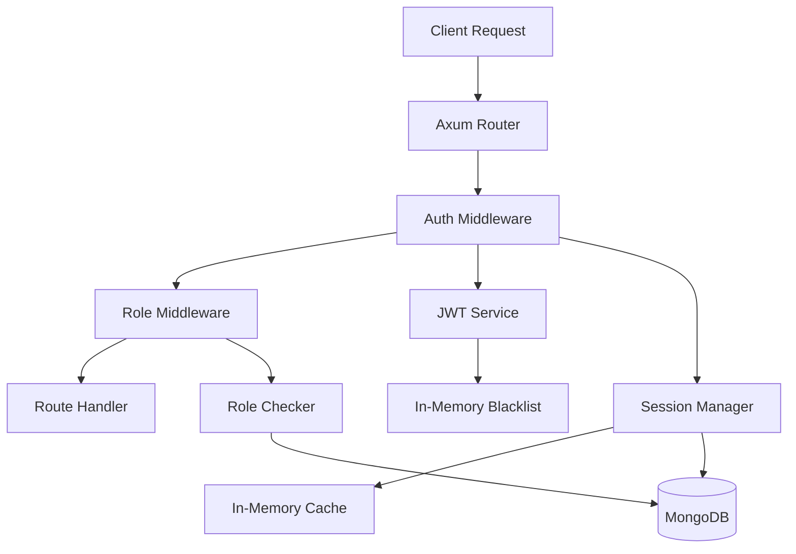
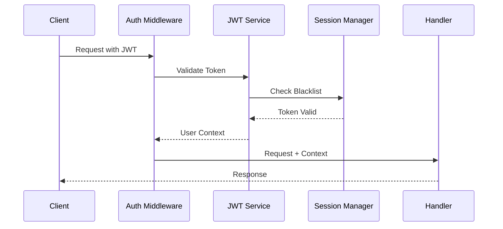

# Authentication Middleware Design Document

## Overview

This design document outlines the implementation of a comprehensive authentication and authorization middleware system for the Rust backend API. The system follows Zero to Production principles, implementing JWT-based authentication with role-based access control (RBAC) using Axum middleware layers.

The middleware system consists of three main components:
1. **Authentication Middleware** - Validates JWT tokens and extracts user context
2. **Authorization Middleware** - Enforces role-based access control
3. **Session Management** - Handles token lifecycle and security

## Architecture

### High-Level Architecture



### Middleware Stack Order

1. **CORS Middleware** (existing)
2. **Request Logging** (existing)
3. **Authentication Middleware** (new)
4. **Authorization Middleware** (new)
5. **Route Handlers**

### Token Flow



## Components and Interfaces

### 1. JWT Service (`src/services/jwt.rs`)

**Purpose**: Handle JWT token generation, validation, and management.

**Key Structures**:
```rust
pub struct JwtService {
    encoding_key: EncodingKey,
    decoding_key: DecodingKey,
    config: JwtConfig,
}

pub struct JwtConfig {
    pub secret: String,
    pub access_token_expiry: Duration,
    pub refresh_token_expiry: Duration,
    pub issuer: String,
    pub audience: String,
}

#[derive(Serialize, Deserialize)]
pub struct Claims {
    pub sub: String,        // User UUID
    pub email: String,      // User email
    pub role: UserRole,     // User role
    pub exp: usize,         // Expiration
    pub iat: usize,         // Issued at
    pub iss: String,        // Issuer
    pub aud: String,        // Audience
    pub jti: String,        // JWT ID for blacklisting
}

#[derive(Serialize, Deserialize)]
pub enum UserRole {
    Player,
    Admin,
    SuperAdmin,
}
```

**Key Methods**:
- `generate_access_token(user: &Player) -> Result<String, JwtError>`
- `generate_refresh_token(user: &Player) -> Result<String, JwtError>`
- `validate_token(token: &str) -> Result<Claims, JwtError>`
- `refresh_access_token(refresh_token: &str) -> Result<TokenPair, JwtError>`

### 2. Authentication Middleware (`src/middleware/auth.rs`)

**Purpose**: Extract and validate JWT tokens from requests.

**Key Structures**:
```rust
pub struct AuthMiddleware {
    jwt_service: Arc<JwtService>,
    session_manager: Arc<SessionManager>,
}

#[derive(Clone)]
pub struct UserContext {
    pub user_uuid: Uuid,
    pub email: String,
    pub role: UserRole,
    pub token_id: String,
}

pub enum AuthError {
    MissingToken,
    InvalidToken,
    ExpiredToken,
    BlacklistedToken,
    InternalError(String),
}
```

**Implementation Pattern**:
```rust
impl<S> Layer<S> for AuthMiddleware {
    type Service = AuthService<S>;
    
    fn layer(&self, inner: S) -> Self::Service {
        AuthService {
            inner,
            jwt_service: self.jwt_service.clone(),
            session_manager: self.session_manager.clone(),
        }
    }
}
```

### 3. Smart Authorization Middleware (`src/middleware/ownership.rs`)

**Purpose**: Automatically validate resource ownership based on route patterns.

**Key Structures**:
```rust
// Smart middleware that understands route patterns
pub struct RequireOwnership {
    validation_type: OwnershipValidationType,
}

pub enum OwnershipValidationType {
    Player(String),     // Parameter name containing player UUID
    Race(String),       // Parameter name containing race UUID  
    Custom(Box<dyn Fn(&UserContext, &Request) -> BoxFuture<'static, bool> + Send + Sync>),
}

impl RequireOwnership {
    // Factory methods for common patterns
    pub fn player(param_name: &str) -> Self {
        Self {
            validation_type: OwnershipValidationType::Player(param_name.to_string()),
        }
    }
    
    pub fn race(param_name: &str) -> Self {
        Self {
            validation_type: OwnershipValidationType::Race(param_name.to_string()),
        }
    }
    
    pub fn custom<F>(validator: F) -> Self 
    where
        F: Fn(&UserContext, &Request) -> BoxFuture<'static, bool> + Send + Sync + 'static,
    {
        Self {
            validation_type: OwnershipValidationType::Custom(Box::new(validator)),
        }
    }
}

// Simple role-based middleware
pub struct RequireRole {
    required_role: UserRole,
}

impl RequireRole {
    pub fn admin() -> Self {
        Self { required_role: UserRole::Admin }
    }
    
    pub fn player() -> Self {
        Self { required_role: UserRole::Player }
    }
}
```

**How RequireOwnership Layer Works**:

The `RequireOwnership` layer is an Axum middleware that sits between the router and your handlers. Here's how it works step by step:

```rust
// 1. Layer Creation - You specify what to validate
.layer(RequireOwnership::player("player_uuid"))

// This creates a middleware that will:
// - Look for a path parameter named "player_uuid" 
// - Extract its value (e.g., "123e4567-e89b-12d3-a456-426614174000")
// - Check if the authenticated user owns that player resource
// - Only allow the request through if they do (or if they're admin)
```

**Step-by-Step Execution Flow**:

```rust
// When a request comes in: GET /players/123e4567-e89b-12d3-a456-426614174000/cars

// 1. Auth middleware runs first (validates JWT, extracts user)
// 2. RequireOwnership middleware runs second
impl<S> Service<Request> for OwnershipService<S> {
    fn call(&mut self, request: Request) -> Self::Future {
        Box::pin(async move {
            // STEP 1: Get the authenticated user (from previous auth middleware)
            let user_context = request.extensions().get::<UserContext>().unwrap();
            // user_context.user_uuid = "123e4567-e89b-12d3-a456-426614174000" (the logged-in user)
            // user_context.role = UserRole::Player
            
            // STEP 2: Extract the player_uuid from the URL path
            let requested_player_uuid = extract_uuid_from_path(&request, "player_uuid");
            // requested_player_uuid = "123e4567-e89b-12d3-a456-426614174000" (from URL)
            
            // STEP 3: Check ownership
            let is_authorized = match &self.validation_type {
                OwnershipValidationType::Player(param_name) => {
                    // Check: Does the logged-in user own this player resource?
                    if user_context.role.is_admin() {
                        true  // Admins can access anything
                    } else {
                        user_context.user_uuid == requested_player_uuid
                        // true if user is requesting their own data
                        // false if user is trying to access someone else's data
                    }
                }
            };
            
            // STEP 4: Allow or deny
            if !is_authorized {
                // Return 404 (not 403) to avoid leaking resource existence
                return Ok(Response::builder()
                    .status(StatusCode::NOT_FOUND)
                    .body(Body::from(r#"{"error":"resource_not_found"}"#))
                    .unwrap());
            }
            
            // STEP 5: Authorization passed - call the actual handler
            self.inner.call(request).await
        })
    }
}
```

**Real-World Example**:

```rust
// Route configuration
Router::new()
    .route("/players/:player_uuid/cars", get(get_player_cars))
    .layer(RequireOwnership::player("player_uuid"))

// What happens with different requests:

// ✅ ALLOWED: User requests their own data
// GET /players/user123/cars
// - Logged-in user UUID: "user123"
// - Requested player_uuid: "user123" 
// - user123 == user123 ✓ → Allow request → Handler runs

// ❌ BLOCKED: User tries to access someone else's data  
// GET /players/user456/cars
// - Logged-in user UUID: "user123"
// - Requested player_uuid: "user456"
// - user123 != user456 ✗ → Return 404 → Handler never runs

// ✅ ALLOWED: Admin can access anyone's data
// GET /players/user456/cars  
// - Logged-in user role: Admin
// - Admin role check ✓ → Allow request → Handler runs
```

**Your Handler Stays Clean**:

```rust
// This handler has ZERO security code!
pub async fn get_player_cars(
    State(db): State<Database>,
    Path(player_uuid): Path<Uuid>,  // This UUID is guaranteed to be owned by the user
) -> Result<Json<Vec<Car>>, StatusCode> {
    // No need to check:
    // - Is user authenticated? (Auth middleware did this)
    // - Does user own this player? (Ownership middleware did this)
    // - Is this a valid UUID? (Axum path extraction did this)
    
    // Just do the business logic!
    let cars = get_cars_for_player(&db, player_uuid).await
        .map_err(|_| StatusCode::INTERNAL_SERVER_ERROR)?;
    
    Ok(Json(cars))
}
```

**Different Validation Types**:

```rust
// 1. Player ownership (most common)
.layer(RequireOwnership::player("player_uuid"))
// Validates: logged_in_user.uuid == path_param.player_uuid

// 2. Race participation (custom logic)  
.layer(RequireOwnership::custom(|user_context, request| {
    Box::pin(async move {
        let race_uuid = extract_uuid_from_path(request, "race_uuid")?;
        // Check database: is this user a participant in this race?
        is_race_participant(user_context.user_uuid, race_uuid).await
    })
}))

// 3. Admin only
.layer(RequireRole::admin())
// Validates: user.role == Admin
```

**Key Benefits**:

1. **Automatic**: No manual checks in handlers
2. **Consistent**: Same validation logic everywhere  
3. **Secure by default**: Handlers can't forget to check ownership
4. **Clean errors**: Standardized 404 responses
5. **Performance**: Validation happens once, not in every handler

The middleware essentially creates a "security boundary" - if your handler runs, you're guaranteed the user has permission to access that resource!

// Validation functions
async fn validate_player_ownership(
    user_context: &UserContext,
    request: &Request,
    param_name: &str,
) -> bool {
    // Admin can access anything
    if user_context.role.is_admin() {
        return true;
    }
    
    // Extract UUID from path
    if let Some(player_uuid) = extract_uuid_from_path(request, param_name) {
        return user_context.user_uuid == player_uuid;
    }
    
    false
}

async fn validate_race_ownership(
    user_context: &UserContext,
    request: &Request,
    param_name: &str,
) -> bool {
    // Admin can access anything
    if user_context.role.is_admin() {
        return true;
    }
    
    // For races, check if user is a participant
    if let Some(race_uuid) = extract_uuid_from_path(request, param_name) {
        // This would require database access - see async validation below
        return check_race_participation(user_context.user_uuid, race_uuid).await;
    }
    
    false
}

// Helper function to extract UUIDs from path
fn extract_uuid_from_path(request: &Request, param_name: &str) -> Option<Uuid> {
    request.extensions()
        .get::<MatchedPath>()
        .and_then(|matched_path| {
            // Extract from axum path parameters
            // This integrates with axum's path extraction
            extract_param_from_matched_path(matched_path, param_name)
        })
        .and_then(|uuid_str| Uuid::parse_str(&uuid_str).ok())
}
```

**Simplified Usage with Smart Middleware**:
```rust
// Declarative ownership validation using path parameter patterns
Router::new()
    // Automatically validates user owns player_uuid parameter
    .route("/players/:player_uuid", get(get_player))
    .route("/players/:player_uuid/profile", put(update_player_profile))
    .route("/players/:player_uuid/cars", get(get_player_cars))
    .route("/players/:player_uuid/cars", post(add_car_to_player))
    .layer(RequireOwnership::player("player_uuid"))  // Smart middleware
    
    // Admin-only endpoints
    .route("/admin/players", get(get_all_players))
    .layer(RequireRole::admin())
    
    // Race participation validation (custom logic)
    .route("/races/:race_uuid/join", post(join_race))
    .layer(RequireOwnership::custom(validate_race_access))
    
    // Public endpoints (no middleware)
    .route("/races", get(get_public_races))

// Clean handlers - no ownership validation needed!
pub async fn get_player_cars(
    State(db): State<Database>,
    Path(player_uuid): Path<Uuid>,
    Extension(user_context): Extension<UserContext>, // Guaranteed valid by middleware
) -> Result<Json<Vec<Car>>, StatusCode> {
    // Middleware guarantees user can access this player_uuid
    // Just fetch the data - no validation needed!
    let cars = get_cars_for_player(&db, player_uuid).await
        .map_err(|_| StatusCode::INTERNAL_SERVER_ERROR)?;
    
    Ok(Json(cars))
}

// Even simpler - no user_context needed if you don't use it
pub async fn update_player_profile(
    State(db): State<Database>,
    Path(player_uuid): Path<Uuid>,
    Json(update): Json<ProfileUpdate>,
) -> Result<Json<Player>, StatusCode> {
    // Middleware already validated ownership
    let updated_player = update_player_profile_in_db(&db, player_uuid, update).await
        .map_err(|_| StatusCode::INTERNAL_SERVER_ERROR)?;
    
    Ok(Json(updated_player))
}
```

### 4. Session Manager (`src/services/session.rs`)

**Purpose**: Manage token lifecycle, blacklisting, and session security using MongoDB and in-memory caching.

**Key Structures**:
```rust
pub struct SessionManager {
    database: Arc<Database>,
    blacklist_cache: Arc<RwLock<HashSet<String>>>,
    session_cache: Arc<RwLock<HashMap<String, Session>>>,
    config: SessionConfig,
}

pub struct SessionConfig {
    pub max_sessions_per_user: usize,
    pub session_timeout: Duration,
    pub blacklist_cleanup_interval: Duration,
    pub cache_size_limit: usize,
}

#[derive(Serialize, Deserialize, Clone)]
pub struct Session {
    pub id: Option<ObjectId>,
    pub user_uuid: Uuid,
    pub token_id: String,
    pub created_at: DateTime<Utc>,
    pub last_activity: DateTime<Utc>,
    pub expires_at: DateTime<Utc>,
    pub ip_address: Option<String>,
    pub user_agent: Option<String>,
    pub is_active: bool,
}

#[derive(Serialize, Deserialize)]
pub struct BlacklistedToken {
    pub id: Option<ObjectId>,
    pub token_id: String,
    pub user_uuid: Uuid,
    pub blacklisted_at: DateTime<Utc>,
    pub expires_at: DateTime<Utc>,
    pub reason: String,
}
```

**Key Methods**:
- `create_session(user_uuid: Uuid, token_id: String, metadata: SessionMetadata) -> Result<(), SessionError>`
- `validate_session(token_id: &str) -> Result<bool, SessionError>`
- `invalidate_session(token_id: &str, reason: &str) -> Result<(), SessionError>`
- `invalidate_all_user_sessions(user_uuid: Uuid, reason: &str) -> Result<(), SessionError>`
- `cleanup_expired_sessions() -> Result<usize, SessionError>`
- `is_token_blacklisted(token_id: &str) -> Result<bool, SessionError>`

## Resource Ownership Enforcement Patterns

### 1. Direct Resource Ownership

For resources directly owned by users (players, user profiles):

```rust
// Route: GET /players/:player_uuid
// Middleware validates: user_uuid == player_uuid OR user.is_admin()

pub async fn get_player_by_uuid(
    State(database): State<Database>,
    Path(player_uuid): Path<Uuid>,
    Extension(user_context): Extension<UserContext>,
) -> Result<Json<Player>, StatusCode> {
    // Ownership already validated by middleware
    // Safe to fetch the player data
    match get_player_by_uuid_from_db(&database, player_uuid).await {
        Ok(Some(player)) => Ok(Json(player)),
        Ok(None) => Err(StatusCode::NOT_FOUND),
        Err(_) => Err(StatusCode::INTERNAL_SERVER_ERROR),
    }
}
```

### 2. Nested Resource Ownership

For resources owned through parent relationships (cars owned by players):

```rust
// Route: GET /players/:player_uuid/cars/:car_uuid
// Validation: player owns car AND (user owns player OR user.is_admin())

pub async fn get_player_car(
    State(database): State<Database>,
    Path((player_uuid, car_uuid)): Path<(Uuid, Uuid)>,
    Extension(user_context): Extension<UserContext>,
) -> Result<Json<Car>, StatusCode> {
    // 1. Middleware validated player ownership
    // 2. Now validate car belongs to player
    
    let player = get_player_by_uuid_from_db(&database, player_uuid).await
        .map_err(|_| StatusCode::INTERNAL_SERVER_ERROR)?
        .ok_or(StatusCode::NOT_FOUND)?;
    
    // Check if car belongs to this player
    let car = player.cars.iter()
        .find(|c| c.uuid == car_uuid)
        .ok_or(StatusCode::NOT_FOUND)?;
    
    Ok(Json(car.clone()))
}
```

### 3. Query Parameter Filtering

For list endpoints, automatically filter results based on ownership:

```rust
// Route: GET /races?player_uuid=xxx
// Auto-filter: only show races where user is participant OR user.is_admin()

pub async fn get_races(
    State(database): State<Database>,
    Query(params): Query<HashMap<String, String>>,
    Extension(user_context): Extension<UserContext>,
) -> Result<Json<Vec<Race>>, StatusCode> {
    let mut filter = doc! {};
    
    // If not admin, automatically filter to user's races
    if !user_context.role.is_admin() {
        filter.insert("participants.player_uuid", user_context.user_uuid.to_string());
    }
    
    // Apply additional query filters
    if let Some(status) = params.get("status") {
        filter.insert("status", status);
    }
    
    let races = get_races_with_filter(&database, filter).await
        .map_err(|_| StatusCode::INTERNAL_SERVER_ERROR)?;
    
    Ok(Json(races))
}
```

### 4. Database-Level Security

Implement ownership checks at the database query level:

```rust
// Always include ownership filter in database queries
pub async fn get_player_cars_from_db(
    database: &Database,
    player_uuid: Uuid,
    requesting_user_uuid: Uuid,
    user_role: &UserRole,
) -> Result<Vec<Car>, mongodb::error::Error> {
    let collection = database.collection::<Player>("players");
    
    let mut filter = doc! { "uuid": player_uuid.to_string() };
    
    // Non-admin users can only access their own data
    if !user_role.is_admin() {
        filter.insert("uuid", requesting_user_uuid.to_string());
    }
    
    let player = collection.find_one(filter, None).await?
        .ok_or_else(|| mongodb::error::Error::custom("Player not found or access denied"))?;
    
    Ok(player.cars)
}
```

### 5. Clean Middleware Configuration

**Declarative, pattern-based route protection**:

```rust
// Clean, readable route configuration
pub fn configure_auth_routes() -> Router<Database> {
    Router::new()
        // Player resource routes - automatically validates player_uuid ownership
        .nest("/players", player_routes())
        
        // Race routes with different access patterns
        .nest("/races", race_routes())
        
        // Admin routes
        .nest("/admin", admin_routes())
}

fn player_routes() -> Router<Database> {
    Router::new()
        // All these routes automatically validate player_uuid ownership
        .route("/:player_uuid", get(get_player))
        .route("/:player_uuid", put(update_player))
        .route("/:player_uuid", delete(delete_player))
        .route("/:player_uuid/profile", get(get_player_profile))
        .route("/:player_uuid/profile", put(update_player_profile))
        .route("/:player_uuid/cars", get(get_player_cars))
        .route("/:player_uuid/cars", post(add_car_to_player))
        .route("/:player_uuid/cars/:car_uuid", get(get_player_car))
        .route("/:player_uuid/cars/:car_uuid", delete(remove_car_from_player))
        .route("/:player_uuid/pilots", get(get_player_pilots))
        .route("/:player_uuid/pilots", post(add_pilot_to_player))
        // One middleware layer protects all player routes!
        .layer(RequireOwnership::player("player_uuid"))
}

fn race_routes() -> Router<Database> {
    Router::new()
        // Public race endpoints (no auth needed)
        .route("/", get(get_public_races))
        .route("/:race_uuid", get(get_race_details))
        
        // Participant-only endpoints
        .route("/:race_uuid/join", post(join_race))
        .route("/:race_uuid/leave", post(leave_race))
        .route("/:race_uuid/turn", post(submit_turn))
        .layer(RequireOwnership::custom(|user_context, request| {
            Box::pin(async move {
                // Custom validation: user must be race participant or admin
                if user_context.role.is_admin() {
                    return true;
                }
                
                if let Some(race_uuid) = extract_uuid_from_path(request, "race_uuid") {
                    return is_race_participant(user_context.user_uuid, race_uuid).await;
                }
                
                false
            })
        }))
        
        // Admin-only race management
        .route("/:race_uuid/start", post(start_race))
        .route("/:race_uuid/end", post(end_race))
        .layer(RequireRole::admin())
}

fn admin_routes() -> Router<Database> {
    Router::new()
        .route("/players", get(get_all_players))
        .route("/players/:player_uuid/ban", post(ban_player))
        .route("/races", get(get_all_races))
        .route("/system/stats", get(get_system_stats))
        // All admin routes protected with one layer
        .layer(RequireRole::admin())
}

// Database helper for race participation validation
async fn is_race_participant(user_uuid: Uuid, race_uuid: Uuid) -> bool {
    // This would be implemented to check database
    // Could be cached for performance
    check_race_participation_in_db(user_uuid, race_uuid).await.unwrap_or(false)
}
```

**Benefits of this approach**:

1. **No validation code in handlers** - Middleware guarantees authorization
2. **Declarative security** - Route structure shows security model
3. **Consistent error responses** - All handled by middleware
4. **Easy to audit** - Security rules are visible in route configuration
5. **Performance** - Validation happens once in middleware, not per handler
6. **Maintainable** - Add new routes without repeating validation logic

**Example of completely clean handlers**:

```rust
// Handler has zero security concerns - middleware handles everything
pub async fn get_player_cars(
    State(db): State<Database>,
    Path(player_uuid): Path<Uuid>,
) -> Result<Json<Vec<Car>>, StatusCode> {
    // No auth checks needed - middleware guarantees user can access this player_uuid
    let cars = get_cars_for_player(&db, player_uuid).await
        .map_err(|_| StatusCode::INTERNAL_SERVER_ERROR)?;
    
    Ok(Json(cars))
}

// Even complex operations are simple
pub async fn transfer_car_between_players(
    State(db): State<Database>,
    Path((from_player_uuid, to_player_uuid, car_uuid)): Path<(Uuid, Uuid, Uuid)>,
) -> Result<Json<TransferResult>, StatusCode> {
    // Middleware already validated user owns from_player_uuid
    // Just execute the business logic
    let result = transfer_car(&db, from_player_uuid, to_player_uuid, car_uuid).await
        .map_err(|_| StatusCode::INTERNAL_SERVER_ERROR)?;
    
    Ok(Json(result))
}
```

### 6. Error Handling for Ownership Violations

Provide clear, secure error messages:

```rust
pub enum OwnershipError {
    NotFound,           // Resource doesn't exist (same response for unauthorized)
    Forbidden,          // User lacks permission
    InvalidResource,    // Resource ID format invalid
}

impl From<OwnershipError> for StatusCode {
    fn from(error: OwnershipError) -> Self {
        match error {
            OwnershipError::NotFound => StatusCode::NOT_FOUND,
            OwnershipError::Forbidden => StatusCode::FORBIDDEN,
            OwnershipError::InvalidResource => StatusCode::BAD_REQUEST,
        }
    }
}

// Security: Don't leak information about resource existence
// Return 404 for both "not found" and "not authorized"
pub fn secure_not_found_response() -> (StatusCode, Json<Value>) {
    (
        StatusCode::NOT_FOUND,
        Json(json!({
            "error": "resource_not_found",
            "message": "The requested resource was not found"
        }))
    )
}
```

## Data Models

### 1. Enhanced Player Model

Add role field to existing Player domain model:

```rust
// In src/domain/player.rs
#[derive(Serialize, Deserialize)]
pub struct Player {
    // ... existing fields
    pub role: UserRole,
    pub last_login: Option<DateTime<Utc>>,
    pub login_count: u64,
}

impl Player {
    pub fn is_admin(&self) -> bool {
        matches!(self.role, UserRole::Admin | UserRole::SuperAdmin)
    }
    
    pub fn can_access_resource(&self, resource_owner_uuid: Uuid) -> bool {
        self.is_admin() || self.uuid == resource_owner_uuid
    }
}
```

### 2. Token Blacklist and Session Storage

MongoDB collections with in-memory caching for performance:

```rust
// MongoDB Collections
// Collection: "sessions"
// Collection: "blacklisted_tokens"

// In-memory cache structures
pub struct SessionCache {
    // token_id -> Session (LRU cache with size limit)
    sessions: HashMap<String, Session>,
    // token_id for quick blacklist lookup
    blacklisted_tokens: HashSet<String>,
    // user_uuid -> Vec<token_id> for user session tracking
    user_sessions: HashMap<Uuid, Vec<String>>,
}

// Cache management
impl SessionManager {
    fn cache_session(&self, session: Session) -> Result<(), SessionError>;
    fn evict_from_cache(&self, token_id: &str) -> Result<(), SessionError>;
    fn sync_cache_with_db(&self) -> Result<(), SessionError>;
    fn cleanup_cache(&self) -> Result<(), SessionError>;
}
```

## Error Handling

### Standardized Error Responses

```rust
#[derive(Serialize)]
pub struct AuthErrorResponse {
    pub error: String,
    pub error_code: String,
    pub message: String,
    pub timestamp: DateTime<Utc>,
}

impl From<AuthError> for AuthErrorResponse {
    fn from(error: AuthError) -> Self {
        match error {
            AuthError::MissingToken => Self {
                error: "authentication_required".to_string(),
                error_code: "AUTH_001".to_string(),
                message: "Authentication token is required".to_string(),
                timestamp: Utc::now(),
            },
            AuthError::InvalidToken => Self {
                error: "invalid_token".to_string(),
                error_code: "AUTH_002".to_string(),
                message: "The provided token is invalid".to_string(),
                timestamp: Utc::now(),
            },
            // ... other error mappings
        }
    }
}
```

### HTTP Status Code Mapping

- `401 Unauthorized`: Missing, invalid, or expired tokens
- `403 Forbidden`: Valid token but insufficient permissions
- `429 Too Many Requests`: Rate limiting exceeded
- `500 Internal Server Error`: JWT service or session manager errors

## Testing Strategy

### Unit Tests

1. **JWT Service Tests**
   - Token generation with various user roles
   - Token validation with valid/invalid/expired tokens
   - Token refresh functionality
   - Error handling for malformed tokens

2. **Middleware Tests**
   - Authentication middleware with various token states
   - Authorization middleware with different role requirements
   - Resource ownership validation
   - Error response formatting

3. **Session Manager Tests**
   - Session creation and validation
   - Token blacklisting functionality
   - Session cleanup and expiration
   - Multi-session management per user

### Integration Tests

1. **End-to-End Authentication Flow**
   - Login → Token generation → Protected route access
   - Token refresh workflow
   - Logout → Token invalidation

2. **Authorization Scenarios**
   - Player accessing own resources
   - Player attempting to access other player resources
   - Admin accessing any resources
   - Role-based endpoint protection

3. **Security Tests**
   - Token tampering detection
   - Expired token handling
   - Blacklisted token rejection
   - Rate limiting enforcement

### Performance Tests

1. **Middleware Overhead**
   - Request processing time with/without middleware
   - Memory usage under load
   - In-memory cache hit/miss ratios

2. **Scalability Tests**
   - Concurrent authentication requests
   - MongoDB session storage performance
   - In-memory blacklist lookup performance
   - Cache synchronization efficiency

## Security Considerations

### Token Security

1. **JWT Configuration**
   - Use RS256 algorithm for production (asymmetric keys)
   - Short access token expiry (15-30 minutes)
   - Longer refresh token expiry (7-30 days)
   - Include security claims (iss, aud, jti)

2. **Secret Management**
   - Store JWT secrets in environment variables
   - Use different secrets for different environments
   - Implement secret rotation capability

### Session Security

1. **Session Management**
   - Limit concurrent sessions per user
   - Track session metadata (IP, User-Agent)
   - Implement session timeout
   - Log security events

2. **Rate Limiting**
   - Implement per-user rate limiting
   - Different limits for different endpoints
   - Exponential backoff for failed attempts

### Production Hardening

1. **HTTPS Enforcement**
   - Reject HTTP requests in production
   - Set secure cookie flags
   - Implement HSTS headers

2. **Monitoring and Alerting**
   - Log authentication failures
   - Monitor for suspicious patterns
   - Alert on mass token invalidation
   - Track session anomalies

## Configuration

### Environment Variables

```bash
# JWT Configuration
JWT_SECRET=your-super-secret-key-here
JWT_ACCESS_TOKEN_EXPIRY=1800  # 30 minutes
JWT_REFRESH_TOKEN_EXPIRY=2592000  # 30 days
JWT_ISSUER=racing-game-api
JWT_AUDIENCE=racing-game-client

# Session Configuration
MAX_SESSIONS_PER_USER=5
SESSION_TIMEOUT=86400  # 24 hours
BLACKLIST_CLEANUP_INTERVAL=3600  # 1 hour
SESSION_CACHE_SIZE_LIMIT=10000  # Max cached sessions
CACHE_SYNC_INTERVAL=300  # 5 minutes

# Security Configuration
RATE_LIMIT_REQUESTS_PER_MINUTE=60
ENABLE_HTTPS_ONLY=true
LOG_SECURITY_EVENTS=true
```

### Feature Flags

```rust
pub struct SecurityConfig {
    pub enable_rate_limiting: bool,
    pub enable_session_tracking: bool,
    pub enable_security_logging: bool,
    pub strict_https_only: bool,
    pub enable_token_refresh: bool,
}
```

## Frontend Session Management

### Cookie-Based Token Storage

The frontend will use secure HTTP-only cookies for token storage to prevent XSS attacks:

```typescript
// Frontend token management
interface TokenResponse {
  access_token: string;
  refresh_token: string;
  expires_in: number;
  token_type: 'Bearer';
}

// Cookie configuration
const COOKIE_CONFIG = {
  httpOnly: true,        // Prevent XSS access
  secure: true,          // HTTPS only in production
  sameSite: 'strict',    // CSRF protection
  maxAge: 30 * 60 * 1000, // 30 minutes for access token
  path: '/',
};
```

### Backend Cookie Handling

The Rust backend will set and manage cookies:

```rust
// In auth routes (login endpoint)
pub async fn login_user(
    State(db): State<Database>,
    Json(credentials): Json<UserCredentials>,
) -> Result<(StatusCode, Json<Value>), (StatusCode, Json<Value>)> {
    // ... authentication logic ...
    
    let access_token = jwt_service.generate_access_token(&user)?;
    let refresh_token = jwt_service.generate_refresh_token(&user)?;
    
    // Set secure cookies
    let access_cookie = Cookie::build(("access_token", access_token))
        .http_only(true)
        .secure(true)
        .same_site(SameSite::Strict)
        .max_age(Duration::minutes(30))
        .path("/")
        .build();
        
    let refresh_cookie = Cookie::build(("refresh_token", refresh_token))
        .http_only(true)
        .secure(true)
        .same_site(SameSite::Strict)
        .max_age(Duration::days(30))
        .path("/auth/refresh")  // Only send to refresh endpoint
        .build();
    
    // Return response with cookies
    Ok((
        StatusCode::OK,
        [(SET_COOKIE, access_cookie.to_string()),
         (SET_COOKIE, refresh_cookie.to_string())],
        Json(json!({
            "message": "Login successful",
            "user": {
                "uuid": user.uuid,
                "email": user.email.as_ref(),
                "role": user.role
            }
        }))
    ))
}
```

### Authentication Middleware Cookie Extraction

```rust
// Extract token from cookies instead of Authorization header
impl AuthMiddleware {
    fn extract_token_from_request(request: &Request) -> Option<String> {
        // Try Authorization header first (for API clients)
        if let Some(auth_header) = request.headers().get(AUTHORIZATION) {
            if let Ok(auth_str) = auth_header.to_str() {
                if auth_str.starts_with("Bearer ") {
                    return Some(auth_str[7..].to_string());
                }
            }
        }
        
        // Fall back to cookie (for web clients)
        if let Some(cookie_header) = request.headers().get(COOKIE) {
            if let Ok(cookie_str) = cookie_header.to_str() {
                for cookie in cookie_str.split(';') {
                    let cookie = cookie.trim();
                    if cookie.starts_with("access_token=") {
                        return Some(cookie[13..].to_string());
                    }
                }
            }
        }
        
        None
    }
}
```

### Frontend Authentication Flow

```typescript
// Frontend auth service
class AuthService {
  async login(email: string, password: string): Promise<User> {
    const response = await fetch('/api/v1/auth/login', {
      method: 'POST',
      headers: { 'Content-Type': 'application/json' },
      credentials: 'include', // Include cookies
      body: JSON.stringify({ email, password }),
    });
    
    if (!response.ok) {
      throw new Error('Login failed');
    }
    
    const data = await response.json();
    return data.user;
  }
  
  async refreshToken(): Promise<void> {
    const response = await fetch('/api/v1/auth/refresh', {
      method: 'POST',
      credentials: 'include', // Send refresh token cookie
    });
    
    if (!response.ok) {
      throw new Error('Token refresh failed');
    }
    
    // New access token will be set as cookie automatically
  }
  
  async logout(): Promise<void> {
    await fetch('/api/v1/auth/logout', {
      method: 'POST',
      credentials: 'include',
    });
    
    // Cookies will be cleared by backend
  }
  
  async makeAuthenticatedRequest(url: string, options: RequestInit = {}): Promise<Response> {
    const response = await fetch(url, {
      ...options,
      credentials: 'include', // Always include cookies
    });
    
    // Handle token refresh on 401
    if (response.status === 401) {
      try {
        await this.refreshToken();
        // Retry original request
        return fetch(url, {
          ...options,
          credentials: 'include',
        });
      } catch {
        // Refresh failed, redirect to login
        window.location.href = '/login';
        throw new Error('Authentication required');
      }
    }
    
    return response;
  }
}
```

### Logout Implementation

```rust
// Backend logout endpoint
pub async fn logout_user(
    State(session_manager): State<Arc<SessionManager>>,
    request: Request,
) -> Result<StatusCode, (StatusCode, Json<Value>)> {
    // Extract token from cookie
    let token = extract_token_from_request(&request)
        .ok_or_else(|| (StatusCode::UNAUTHORIZED, Json(json!({"error": "No token found"}))))?;
    
    // Invalidate session
    session_manager.invalidate_session(&token, "user_logout").await
        .map_err(|_| (StatusCode::INTERNAL_SERVER_ERROR, Json(json!({"error": "Logout failed"}))))?;
    
    // Clear cookies
    let clear_access = Cookie::build(("access_token", ""))
        .max_age(Duration::seconds(0))
        .path("/")
        .build();
        
    let clear_refresh = Cookie::build(("refresh_token", ""))
        .max_age(Duration::seconds(0))
        .path("/auth/refresh")
        .build();
    
    Ok((
        StatusCode::OK,
        [(SET_COOKIE, clear_access.to_string()),
         (SET_COOKIE, clear_refresh.to_string())],
    ))
}
```

### Security Considerations for Cookies

1. **CSRF Protection**: Use `SameSite=Strict` and implement CSRF tokens for state-changing operations
2. **XSS Protection**: HTTP-only cookies prevent JavaScript access
3. **Secure Transport**: Cookies marked as `Secure` only sent over HTTPS
4. **Path Restrictions**: Refresh tokens only sent to refresh endpoints
5. **Expiration**: Proper cookie expiration aligned with JWT expiry

This design provides a robust, scalable authentication and authorization system that follows security best practices while maintaining good performance and developer experience. The cookie-based approach provides better security for web clients while still supporting Bearer token authentication for API clients.