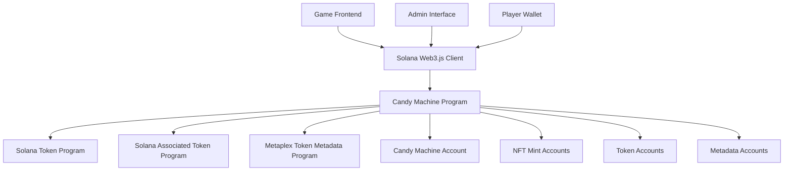

# Design Document

## Overview

The Candy Machine NFT System is a Solana-based smart contract that implements a controlled NFT minting mechanism for the Web3 motorsport blockchain game. The system provides a fair distribution method for game asset NFTs with configurable parameters, supply limits, and metadata standards. Built using the Anchor framework, it ensures secure and efficient NFT creation while maintaining proper economic incentives through royalty structures.

## Architecture

### High-Level Architecture



### Program Architecture

The Candy Machine program follows Anchor's account-based architecture with the following core components:

- **Program Instructions**: Initialize, mint, update configuration
- **Account Structures**: Candy Machine state, mint accounts, token accounts
- **Validation Logic**: Supply limits, authority checks, pricing verification
- **Integration Layer**: Token Program, Associated Token Program, Metadata Program

## Components and Interfaces

### Core Account Structures

#### CandyMachine Account
```rust
#[account]
pub struct CandyMachine {
    pub authority: Pubkey,           // Admin who can update configuration
    pub max_supply: u64,             // Maximum number of NFTs that can be minted
    pub items_redeemed: u64,         // Current number of NFTs minted
    pub price: u64,                  // Price per NFT in lamports
    pub symbol: String,              // Collection symbol (max 10 chars)
    pub seller_fee_basis_points: u16, // Royalty percentage in basis points
    pub bump: u8,                    // PDA bump seed
}
```

#### Mint Context Accounts
```rust
#[derive(Accounts)]
pub struct MintNft<'info> {
    #[account(mut)]
    pub candy_machine: Account<'info, CandyMachine>,
    
    #[account(
        init,
        payer = payer,
        mint::decimals = 0,
        mint::authority = candy_machine,
    )]
    pub mint: Account<'info, Mint>,
    
    #[account(
        init,
        payer = payer,
        associated_token::mint = mint,
        associated_token::authority = payer,
    )]
    pub token_account: Account<'info, TokenAccount>,
    
    /// CHECK: Metadata account will be created by Metaplex program
    #[account(mut)]
    pub metadata: UncheckedAccount<'info>,
    
    #[account(mut)]
    pub payer: Signer<'info>,
    
    pub system_program: Program<'info, System>,
    pub token_program: Program<'info, Token>,
    pub associated_token_program: Program<'info, AssociatedToken>,
    pub rent: Sysvar<'info, Rent>,
}
```

### Program Instructions

#### Initialize Instruction
- **Purpose**: Create and configure a new Candy Machine
- **Authority**: Admin/Creator only
- **Parameters**: max_supply, price, symbol, seller_fee_basis_points
- **Validation**: Ensure Candy Machine doesn't already exist for authority

#### Mint Instruction
- **Purpose**: Mint a new NFT from the Candy Machine
- **Authority**: Any user with sufficient SOL
- **Parameters**: NFT name, metadata URI
- **Validation**: Supply limit, payment verification, account creation

#### Update Instruction
- **Purpose**: Modify Candy Machine configuration
- **Authority**: Original authority only
- **Parameters**: new_price (other parameters immutable after creation)
- **Validation**: Authority verification

### External Program Integration

#### Solana Token Program
- **Purpose**: Create mint accounts and token accounts
- **Usage**: NFT creation with zero decimals
- **Integration**: Direct CPI calls for mint and token account operations

#### Associated Token Program
- **Purpose**: Create associated token accounts for users
- **Usage**: Automatic token account derivation and creation
- **Integration**: CPI calls during mint process

#### Metaplex Token Metadata Program
- **Purpose**: Attach metadata to NFTs
- **Usage**: Store NFT name, URI, symbol, and creator information
- **Integration**: CPI calls to create metadata accounts

## Data Models

### NFT Metadata Structure
```json
{
  "name": "Formula Car #001",
  "symbol": "RACE",
  "description": "High-performance Formula racing car NFT",
  "image": "https://game-assets.example.com/cars/formula/001.png",
  "attributes": [
    {
      "trait_type": "Vehicle Type",
      "value": "Formula Car"
    },
    {
      "trait_type": "Rarity",
      "value": "Epic"
    },
    {
      "trait_type": "Speed",
      "value": 95
    },
    {
      "trait_type": "Acceleration",
      "value": 88
    },
    {
      "trait_type": "Handling",
      "value": 92
    },
    {
      "trait_type": "Durability",
      "value": 85
    }
  ],
  "properties": {
    "creators": [
      {
        "address": "CREATOR_PUBKEY",
        "verified": true,
        "share": 100
      }
    ],
    "files": [
      {
        "uri": "https://game-assets.example.com/cars/formula/001.png",
        "type": "image/png"
      }
    ]
  }
}
```

### Vehicle Types and Rarities
```rust
pub enum VehicleType {
    FormulaCar,
    RallyCar,
    SportsCar,
    Motorcycle,
    Truck,
}

pub enum Rarity {
    Common,    // 60% probability
    Rare,      // 25% probability  
    Epic,      // 12% probability
    Legendary, // 3% probability
}
```

### Performance Attributes
- **Speed**: 1-100 scale affecting top speed
- **Acceleration**: 1-100 scale affecting acceleration rate
- **Handling**: 1-100 scale affecting cornering ability
- **Durability**: 1-100 scale affecting damage resistance

## Error Handling

### Custom Error Types
```rust
#[error_code]
pub enum CandyMachineError {
    #[msg("Maximum supply reached")]
    MaxSupplyReached,
    
    #[msg("Insufficient payment")]
    InsufficientPayment,
    
    #[msg("Unauthorized access")]
    Unauthorized,
    
    #[msg("Invalid metadata URI")]
    InvalidMetadataUri,
    
    #[msg("Candy Machine already exists")]
    CandyMachineExists,
    
    #[msg("Invalid symbol length")]
    InvalidSymbolLength,
    
    #[msg("Invalid seller fee basis points")]
    InvalidSellerFeeBasisPoints,
}
```

### Error Handling Strategy
- **Validation Errors**: Return specific error codes with descriptive messages
- **Account Errors**: Leverage Anchor's built-in account validation
- **CPI Errors**: Propagate errors from external program calls
- **Client Handling**: Provide clear error messages for frontend integration

### Recovery Mechanisms
- **Failed Mints**: Automatic rollback of partial state changes
- **Payment Issues**: Clear error messages for insufficient funds
- **Account Creation**: Proper cleanup of partially created accounts

## Testing Strategy

### Unit Tests
- **Account Initialization**: Test Candy Machine creation with various parameters
- **Mint Functionality**: Test single and batch minting operations
- **Supply Limits**: Test enforcement of maximum supply constraints
- **Authority Checks**: Test update permissions and unauthorized access
- **Error Conditions**: Test all error scenarios and edge cases

### Integration Tests
- **End-to-End Minting**: Test complete mint flow from payment to NFT creation
- **Metadata Integration**: Test Metaplex metadata program integration
- **Token Program Integration**: Test token and associated token account creation
- **Multi-User Scenarios**: Test concurrent minting and supply exhaustion

### Test Data and Fixtures
```rust
// Test configuration constants
const TEST_MAX_SUPPLY: u64 = 100;
const TEST_PRICE: u64 = 1_000_000_000; // 1 SOL in lamports
const TEST_SYMBOL: &str = "TESTRACE";
const TEST_SELLER_FEE_BASIS_POINTS: u16 = 500; // 5%

// Test metadata URIs
const TEST_METADATA_URIS: &[&str] = &[
    "https://test-assets.example.com/car1.json",
    "https://test-assets.example.com/car2.json",
    "https://test-assets.example.com/car3.json",
];
```

### Performance Testing
- **Mint Throughput**: Test minting performance under load
- **Account Size**: Verify account size limits and rent calculations
- **Transaction Costs**: Measure and optimize transaction fees
- **Concurrent Access**: Test multiple users minting simultaneously

### Security Testing
- **Authority Bypass**: Attempt unauthorized configuration updates
- **Supply Manipulation**: Attempt to mint beyond maximum supply
- **Payment Bypass**: Attempt minting without proper payment
- **Account Tampering**: Test resistance to account manipulation attacks

## Implementation Considerations

### Solana Program Constraints
- **Account Size Limits**: Candy Machine account must fit within 10KB limit
- **Rent Exemption**: All accounts must maintain minimum rent balance
- **CPI Limits**: Maximum 4 levels of cross-program invocation
- **Compute Budget**: Optimize instruction complexity for compute limits

### Economic Parameters
- **Default Max Supply**: 100 NFTs (configurable)
- **Minimum Price**: 0.1 SOL (100,000,000 lamports)
- **Maximum Royalty**: 10% (1000 basis points)
- **Rent Costs**: Account for rent-exempt minimums in pricing

### Upgrade Strategy
- **Program Upgrades**: Use Anchor's upgrade authority for bug fixes
- **Data Migration**: Plan for potential account structure changes
- **Backward Compatibility**: Maintain compatibility with existing NFTs
- **Version Management**: Track program version in account data

### Frontend Integration Points
- **Web3.js Integration**: Provide TypeScript client library
- **Wallet Connection**: Support major Solana wallets (Phantom, Solflare)
- **Transaction Building**: Helper functions for instruction creation
- **Event Monitoring**: WebSocket integration for real-time updates