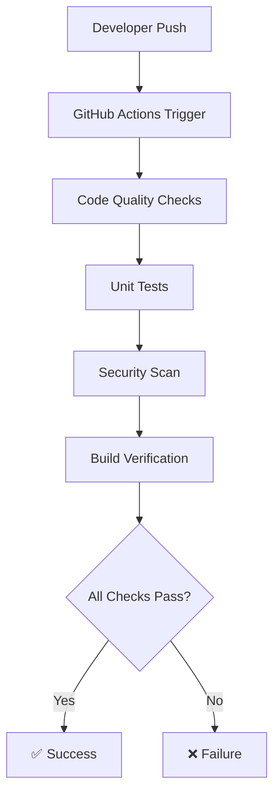
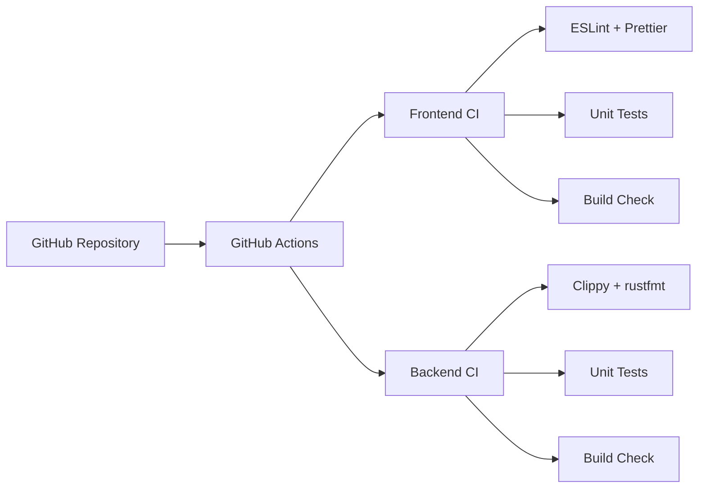

# Design Document

## Overview

This design establishes a simple GitHub Actions-based CI pipeline for the Web3 motorsport racing game project. The system will automate code quality checks, testing, and building for both frontend (React/TypeScript) and backend (Rust) components while maintaining basic security practices and preventing secret exposure. No automatic deployment is included since this is a development project.

## Architecture

### CI Pipeline Architecture



### Simple Workflow Structure



## Components and Interfaces

### GitHub Actions Workflows

#### Frontend CI (`frontend-ci.yml`)
- **Trigger**: Push to any branch, pull requests
- **Jobs**: 
  - Code quality (ESLint, Prettier, TypeScript compilation)
  - Unit testing (Vitest)
  - Build verification (Vite build succeeds)
  - Basic security (npm audit)

#### Backend CI (`backend-ci.yml`)
- **Trigger**: Push to any branch, pull requests
- **Jobs**:
  - Code quality (Clippy, rustfmt, cargo check)
  - Unit testing (cargo test)
  - Build verification (cargo build succeeds)
  - Basic security (cargo audit)

### Secret Management Strategy

#### Minimal GitHub Secrets
```
Development Secrets (if needed):
- TEST_DATABASE_URL (for integration tests)
- DOCKER_USERNAME (if using Docker Hub)
- DOCKER_TOKEN (if using Docker Hub)
```

#### Environment Variable Handling
- Secrets only used for testing/building, not deployment
- Example configuration files with placeholder values
- No production secrets needed since no auto-deployment

## Data Models

### Pipeline Configuration Model
```yaml
SimplePipeline:
  name: string
  trigger: [push, pull_request]
  jobs: Job[]

Job:
  name: string
  runs_on: ubuntu-latest
  steps: Step[]

Step:
  name: string
  uses: string (action) | null
  run: string (command) | null
  with: object (parameters) | null
```

### Basic Security Configuration
```yaml
SecurityConfig:
  dependency_scanning: boolean
  secret_scanning: boolean (basic)
  
SecretPattern:
  name: string
  pattern: string (basic regex)
```

## Correctness Properties

*A property is a characteristic or behavior that should hold true across all valid executions of a system-essentially, a formal statement about what the system should do. Properties serve as the bridge between human-readable specifications and machine-verifiable correctness guarantees.*

Now I need to analyze the acceptance criteria to determine which ones can be tested as properties.

### Converting EARS to Properties

Based on the prework analysis, here are the simplified testable properties for basic CI:

**Property 1: Pipeline Triggering**
*For any* push or pull request, the CI system should automatically trigger the appropriate pipeline (frontend or backend based on changed files)
**Validates: Requirements 2.1, 3.1**

**Property 2: Code Quality Enforcement**
*For any* code submission, the system should run and pass all code quality checks (linting, formatting, compilation) before allowing merge
**Validates: Requirements 2.2, 3.2, 4.1**

**Property 3: Test Execution**
*For any* pipeline run, the system should execute all unit tests and report results
**Validates: Requirements 2.4, 3.3**

**Property 4: Build Verification**
*For any* successful test run, the system should verify that the code builds successfully
**Validates: Requirements 2.3, 3.4**

**Property 5: Security Scanning**
*For any* code change, the system should scan for basic security issues (dependency vulnerabilities, potential secrets)
**Validates: Requirements 1.2, 7.1**

**Property 6: Pull Request Quality Gates**
*For any* pull request, all quality checks must pass before merge is allowed
**Validates: Requirements 4.3, 4.4**

## Error Handling

### Pipeline Failure Recovery
- **Clear Error Messages**: Failed steps provide actionable error messages for developers
- **Failure Isolation**: Individual job failures don't prevent other jobs from running
- **Retry Logic**: Transient failures (network issues) trigger automatic retry once
- **Status Reporting**: Clear success/failure status visible in GitHub interface

### Security Issue Handling
- **Dependency Vulnerabilities**: High-severity vulnerabilities block the pipeline with clear remediation steps
- **Secret Detection**: Potential secrets in code trigger pipeline failure with guidance on proper secret management
- **Audit Logging**: All security scan results logged for review

## Testing Strategy

### Unit Testing Focus
The CI system uses only unit testing for simplicity and speed:

**Unit Tests**: Verify specific pipeline behaviors, individual workflow steps, and code quality checks. Focus on concrete examples like specific linting rules, particular test executions, and known build scenarios.

**No Property-Based Testing**: Simplified approach using only unit tests to keep the CI system lightweight and fast.

### Unit Testing Areas
- Pipeline configuration validation
- Code quality check execution
- Unit test execution and reporting
- Build verification steps
- Basic security scanning
- Pull request merge protection

### Testing Framework
- **GitHub Actions Testing**: Test workflows using GitHub's built-in testing capabilities
- **Local Testing**: Use `act` tool for local GitHub Actions testing
- **Mock Scenarios**: Simulated code changes and test failures for validation

### Performance Goals
- **Fast Feedback**: Pipeline completion under 5 minutes for typical changes
- **Parallel Execution**: Frontend and backend pipelines run independently
- **Efficient Caching**: Node modules and Rust dependencies cached between runs