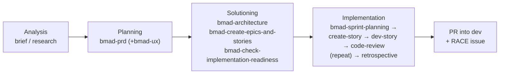

# Building a Feature with BMAD — Boardurance

How we plan and build features now. BMAD v6 (BMM + TEA) is the whole workflow;
`_bmad-output/` is the spec source of truth. This guide is the "how do I actually
start?" companion to the `Method: BMAD v6` section in the root `CLAUDE.md`.

> **Where the skills work.** BMAD ships as Claude Code *skills* (`.claude/skills/bmad-*`).
> Until the adoption PR merges into `dev`, they're active only when you work inside the
> `Boardurance-worktrees/bmad-adoption/` worktree. **After it merges, they're available
> across the repo** — so cut your feature worktree off `dev` as usual.

---

## The 30-second version

```
Is it a small, single-goal change (bug fix, tweak, one endpoint/field)?
   YES ─▶ Quick Flow:  invoke  bmad-quick-dev   (one skill, whole cycle)
   NO  ─▶ Full method: Analysis → Planning → Solutioning → Implementation
                       (PRD → architecture → stories → per-story dev+review)

Not sure where you are?  invoke  bmad-help  — it inspects the project and tells you what's next.
```

---

## How to invoke BMAD

Everything below is a skill. Three equivalent ways to trigger one:

1. **Say what you want** in plain language using the skill's trigger phrase — e.g.
   *"create the PRD"*, *"run sprint planning"*, *"run code review"*. Claude routes to the skill.
2. **Name the skill** explicitly — *"use `bmad-prd`"*.
3. **Talk to a persona** — *"talk to Winston"* loads the architect, who then runs the
   architecture/epics workflows conversationally. Personas are the same workflows with a
   character driving them; pick whichever feels natural.

Lost at any point → **`bmad-help`** (*"what should I do next in BMAD?"*).

---

## The cast (agent personas)

| Invoke | Persona | Skill | Owns | Reach for them when… |
|--------|---------|-------|------|----------------------|
| "talk to **Mary**" 📊 | Business Analyst | `bmad-agent-analyst` | brainstorming, research, product brief | the idea is fuzzy and needs shaping/research |
| "talk to **John**" 📋 | Product Manager | `bmad-agent-pm` | the PRD, requirements | you know the goal, need requirements nailed down |
| "talk to **Sally**" 🎨 | UX Designer | `bmad-agent-ux-designer` | UX specs, interaction design | the feature has meaningful UI |
| "talk to **Winston**" 🏗️ | System Architect | `bmad-agent-architect` | architecture spine, epics & stories | moving from *what* to *how*; parts risk diverging |
| "talk to **Amelia**" 💻 | Senior Software Engineer | `bmad-agent-dev` | implementing a story | a story is ready to build |
| "talk to **Murat**" 🧪 | Test Architect (TEA) | `bmad-tea` | test strategy, automation, NFR, e2e | designing/expanding tests or quality gates |
| "talk to **Paige**" 📚 | Technical Writer | `bmad-agent-tech-writer` | docs, diagrams | you need clear docs or a Mermaid diagram |

Want several at once? **`bmad-party-mode`** runs a roundtable across personas.

---

## Path A — Small change (Quick Flow)

For a bug fix, tweak, or one cohesive single-goal change. One skill runs the entire
cycle: **clarify → plan (spec) → implement → adversarial review → present**, halting at
approval gates.

1. **Cut a worktree** off `dev` (never work in the bare repo):
   ```
   git worktree add ../Boardurance-worktrees/<slug> -b feat/<slug> dev
   ```
2. **Invoke `bmad-quick-dev`** with your intent. Example:
   > use bmad-quick-dev — add a `version` field to `/health_check` from the crate version, without breaking the `"status":"ok"` deploy contract
3. **Approve at the gates** (spec approval; the review may loop back if it finds issues).
   It writes a spec to `_bmad-output/implementation-artifacts/spec-<slug>.md`, implements,
   runs the verify loop, and adversarially reviews its own diff.
4. **Open a PR** into `dev` and mirror a **RACE** issue (see the glue checklist).

> **Real worked example** lives in the repo: `_bmad-output/implementation-artifacts/spec-health-check-version.md`
> (the `/health_check` version field). Its adversarial-review step caught a real bug — read it
> to see the loop in action.

---

## Path B — Full feature (the 4 phases)

For anything with multiple stories or real design decisions. Run the phases in order.
`✅ required` = a gate you shouldn't skip; the rest are offered when relevant.

### Phase 1 — Analysis *(optional; skip if the idea is already clear)*

| Trigger | Skill | Persona |
|---------|-------|---------|
| "help me brainstorm" | `bmad-brainstorming` | Mary |
| "create a product brief" | `bmad-product-brief` | Mary |
| "do domain / technical research" | `bmad-domain-research` / `bmad-technical-research` | Mary |

### Phase 2 — Planning

| Trigger | Skill | Persona | |
|---------|-------|---------|--|
| "create the PRD" | `bmad-prd` | John | ✅ required |
| "create the UX design" | `bmad-ux` | Sally | if there's UI |

### Phase 3 — Solutioning

| Trigger | Skill | Persona | |
|---------|-------|---------|--|
| "create the architecture" | `bmad-architecture` | Winston | ✅ required |
| "create the epics and stories list" | `bmad-create-epics-and-stories` | Winston | ✅ required |
| "check implementation readiness" | `bmad-check-implementation-readiness` | — | ✅ required |
| "design the test plan" | `bmad-testarch-test-design` | Murat | recommended |

### Phase 4 — Implementation

| Trigger | Skill | Persona | |
|---------|-------|---------|--|
| "run sprint planning" | `bmad-sprint-planning` | — | ✅ required (creates `sprint-status.yaml`) |
| "create the next story" | `bmad-create-story` | — | ✅ required (per story) |
| "validate the story" | `bmad-create-story` (validate) | — | recommended |
| "dev this story" / "implement the next story" | `bmad-dev-story` | Amelia | ✅ required — implements + runs the verify loop |
| "run code review" | `bmad-code-review` | — | **gate before every PR** (see glue) |
| "run a retrospective" | `bmad-retrospective` | — | at epic end |

Story loop: **create-story → (validate) → dev-story → code-review →** next story. For a
hands-off batch run there's **`bmad-dev-auto`** (one unattended iteration of the loop).



---

## Testing with TEA (Murat)

TEA is installed. Pull it in for anything test-heavy — artifacts land in
`_bmad-output/test-artifacts/`:

- `bmad-testarch-test-design` — risk-based test plan (Phase 3).
- `bmad-testarch-atdd` — red-phase acceptance tests before implementation.
- `bmad-testarch-automate` / `bmad-qa-generate-e2e-tests` — expand coverage / generate e2e.
- `bmad-testarch-ci` — CI quality pipeline. **First mission for the team:** the DoD wants a
  full browser e2e race, but CI has no automated e2e job yet — TEA is how we close that.
- `bmad-testarch-nfr`, `bmad-testarch-trace` — NFR audit, traceability + gate.

---

## Repo glue (non-negotiable — same as before BMAD)

Do these around every feature, regardless of path:

- [ ] **Worktree per feature** off `dev` (`git worktree add …`). Never `git checkout` in the bare `Boardurance/` repo.
- [ ] **Artifacts are the spec.** Everything BMAD writes goes to `_bmad-output/` (`planning-artifacts/`, `implementation-artifacts/`, `test-artifacts/`) and is committed. `.kiro/` and `openspec/` are frozen history.
- [ ] **Verify loop = Definition of done.** Backend (`rust-backend/`): `cargo fmt --check`, `cargo clippy … -D warnings`, `cargo check`, `cargo test-fast`. Frontend (`empty-project/`): `npx tsc --noEmit`, `npm run test -- --run`, `npm run build`. `bmad-dev-story` runs these; the Stop hook + pre-push are the safety net.
- [ ] **YouTrack RACE issue** per epic/story: To do → In Progress → In Review → Done.
- [ ] **`bmad-code-review` before opening any PR** into `dev` or `main`; resolve blocking findings.
- [ ] **PR into `dev`** (never push features straight to `dev`/`main`). `dev` auto-deploys to preprod.

---

## Cheat sheet

| I want to… | Say | Skill |
|------------|-----|-------|
| Know what to do next | "bmad help" | `bmad-help` |
| Build a small thing end-to-end | "use bmad-quick-dev — <intent>" | `bmad-quick-dev` |
| Write the PRD | "create the PRD" | `bmad-prd` |
| Design the architecture | "create the architecture" | `bmad-architecture` |
| Break into stories | "create the epics and stories list" | `bmad-create-epics-and-stories` |
| Start implementing | "run sprint planning" then "create the next story" | `bmad-sprint-planning`, `bmad-create-story` |
| Implement a story | "dev this story" | `bmad-dev-story` |
| Review before PR | "run code review" | `bmad-code-review` |
| Design tests / e2e | "talk to Murat" | `bmad-tea`, `bmad-testarch-*` |
| Close out an epic | "run a retrospective" | `bmad-retrospective` |

---

## Gotchas & tips

- **Config overrides** go in `_bmad/custom/config.toml` (team, committed) — never edit the
  installer-managed `_bmad/config.toml` / `bmm/config.yaml` (regenerated on reinstall). Use
  `bmad-customize` to change agent/workflow behavior.
- **Project rules** the agents auto-load live in `_bmad-output/project-context.md` (race-model
  invariants, tenant isolation, verify loops, git discipline). Update it when invariants change.
- **`uv` is optional.** BMAD's Python helper scripts run under `uv` if present, else plain
  `python`. Both work here.
- **Pre-push from a worktree can fail** on a Windows `TIMEOUT` bug in the hook (tracked by the
  `fix-pre-push-timeout` branch). If a push dies on that — not on a real check — run the verify
  loop by hand and push with `--no-verify`.
- **New feature, want structured planning?** Start with `bmad-help` and let it route you, or go
  straight to `bmad-prd` for a real feature / `bmad-quick-dev` for a small one.
