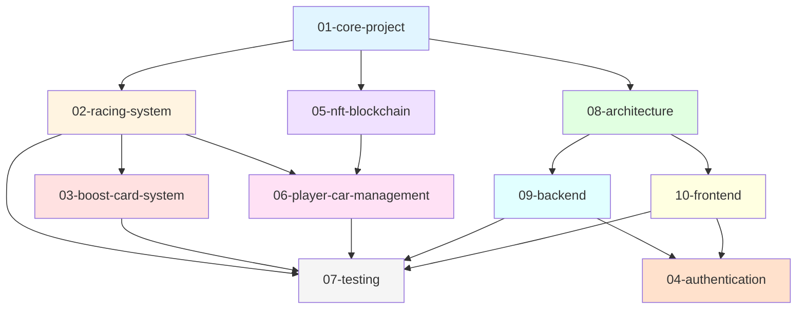

# Documentation Structure Diagram

## Current Structure (Before Migration)

```
docs/
├── README.md
├── PROJECT_OVERVIEW.md
├── QUICK_START.md
├── TECHNOLOGY_STACK.md
├── DEVELOPMENT_WORKFLOW.md
├── GAME_MECHANICS.md
├── API_ROUTES.md
├── BOOST_CARD_API.md
├── BOOST_CARD_EXAMPLES.md
├── openapi-boost-cards.yaml
├── MOVEABLE_ITEMS_IMPLEMENTATION.md
├── BACKEND_README.md
├── BACKEND_DOCKER_SETUP.md
├── FRONTEND_README.md
├── UI_IMPROVEMENTS.md
├── SOLANA_README.md
├── SOLANA_DEPLOYMENT.md
├── SOLANA_SIMPLE_DEPLOYMENT.md
├── TESTING_GUIDE.md
├── Main team.png
├── Main team.pdn
├── architecture/
│   └── FRONTEND_BACKEND_SEPARATION.md
├── implementation/
│   ├── BOOST_AVAILABILITY_ENDPOINT_IMPLEMENTATION.md
│   ├── BOOST_CALCULATION_SIMPLIFICATION.md
│   ├── CAR_PILOTS_UPDATE_SUMMARY.md
│   ├── PILOT_CREATION_IMPLEMENTATION.md
│   ├── PLAYER_CAR_PERFORMANCE_IMPLEMENTATION.md
│   ├── PLAYER_GAME_CONTEXT_IMPLEMENTATION.md
│   ├── TEST_REORGANIZATION_SUMMARY.md
│   ├── TURN_CONTROLLER_IMPLEMENTATION.md
│   └── TURN_PHASE_ENDPOINT_IMPLEMENTATION.md
└── testing/
    ├── BACKEND_TEST_SUITE.md
    ├── BOOST_CARD_INTEGRATION_TESTS.md
    └── TEST_PLAYER_CREATION.md
```

## New Structure (After Migration)

```
docs/
├── README.md (updated)
├── REORGANIZATION_PLAN.md
├── REORGANIZATION_SUMMARY.md
├── STRUCTURE_DIAGRAM.md (this file)
├── migrate-docs.ps1
└── features/
    ├── 01-core-project/
    │   ├── README.md ⭐
    │   ├── PROJECT_OVERVIEW.md
    │   ├── QUICK_START.md
    │   ├── TECHNOLOGY_STACK.md
    │   ├── DEVELOPMENT_WORKFLOW.md
    │   ├── Main team.png
    │   └── Main team.pdn
    │
    ├── 02-racing-system/
    │   ├── README.md ⭐
    │   ├── GAME_MECHANICS.md
    │   ├── API_ROUTES.md
    │   ├── MOVEABLE_ITEMS_IMPLEMENTATION.md
    │   └── implementation/
    │       ├── TURN_CONTROLLER_IMPLEMENTATION.md
    │       └── TURN_PHASE_ENDPOINT_IMPLEMENTATION.md
    │
    ├── 03-boost-card-system/
    │   ├── README.md ⭐
    │   ├── BOOST_CARD_API.md
    │   ├── BOOST_CARD_EXAMPLES.md
    │   ├── openapi-boost-cards.yaml
    │   └── implementation/
    │       ├── BOOST_AVAILABILITY_ENDPOINT_IMPLEMENTATION.md
    │       └── BOOST_CALCULATION_SIMPLIFICATION.md
    │
    ├── 04-authentication/
    │   └── README.md ⭐
    │
    ├── 05-nft-blockchain/
    │   ├── README.md ⭐
    │   ├── SOLANA_README.md
    │   ├── SOLANA_DEPLOYMENT.md
    │   └── SOLANA_SIMPLE_DEPLOYMENT.md
    │
    ├── 06-player-car-management/
    │   ├── README.md ⭐
    │   └── implementation/
    │       ├── CAR_PILOTS_UPDATE_SUMMARY.md
    │       ├── PILOT_CREATION_IMPLEMENTATION.md
    │       ├── PLAYER_CAR_PERFORMANCE_IMPLEMENTATION.md
    │       └── PLAYER_GAME_CONTEXT_IMPLEMENTATION.md
    │
    ├── 07-testing/
    │   ├── README.md ⭐
    │   ├── TESTING_GUIDE.md
    │   ├── BACKEND_TEST_SUITE.md
    │   ├── BOOST_CARD_INTEGRATION_TESTS.md
    │   ├── TEST_PLAYER_CREATION.md
    │   └── TEST_REORGANIZATION_SUMMARY.md
    │
    ├── 08-architecture/
    │   ├── README.md ⭐
    │   └── FRONTEND_BACKEND_SEPARATION.md
    │
    ├── 09-backend/
    │   ├── README.md ⭐
    │   ├── BACKEND_README.md
    │   └── BACKEND_DOCKER_SETUP.md
    │
    └── 10-frontend/
        ├── README.md ⭐
        ├── FRONTEND_README.md
        └── UI_IMPROVEMENTS.md
```

⭐ = New navigation README files

## Feature Relationships



## Navigation Paths

### For Game Developers
```
01-core-project (overview)
    ↓
02-racing-system (mechanics)
    ↓
03-boost-card-system (strategy)
    ↓
06-player-car-management (cars & pilots)
```

### For Backend Developers
```
01-core-project (overview)
    ↓
08-architecture (patterns)
    ↓
09-backend (implementation)
    ↓
04-authentication (auth)
```

### For Frontend Developers
```
01-core-project (overview)
    ↓
08-architecture (patterns)
    ↓
10-frontend (implementation)
    ↓
02-racing-system (game UI)
```

### For Blockchain Developers
```
01-core-project (overview)
    ↓
05-nft-blockchain (Solana)
    ↓
06-player-car-management (NFT attributes)
    ↓
02-racing-system (gameplay integration)
```

## Key Improvements

### Before (Flat Structure)
- ❌ 20+ files in root folder
- ❌ Mixed concerns
- ❌ Hard to find related docs
- ❌ No clear organization
- ❌ Difficult to navigate

### After (Feature-Based)
- ✅ 10 organized feature folders
- ✅ Clear separation of concerns
- ✅ Related docs grouped together
- ✅ Logical hierarchy
- ✅ Easy navigation with READMEs
- ✅ Scalable structure
- ✅ Implementation details in subfolders

## Folder Numbering System

The numbered prefixes ensure consistent ordering:

- **01-09**: Core features and systems
- **10+**: Additional features (room for growth)

This allows:
- Alphabetical sorting matches logical order
- Easy to insert new features
- Clear hierarchy
- Consistent across all tools

## Implementation Subfolders

Some features have `implementation/` subfolders for detailed technical docs:

- **02-racing-system/implementation/** - Turn controller, phase endpoints
- **03-boost-card-system/implementation/** - Boost availability, calculations
- **06-player-car-management/implementation/** - Car pilots, performance, context

This keeps high-level docs clean while preserving detailed implementation information.
