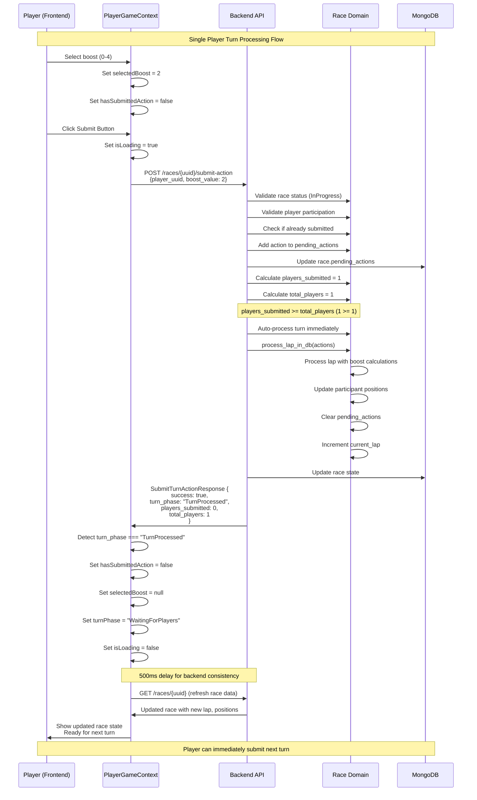
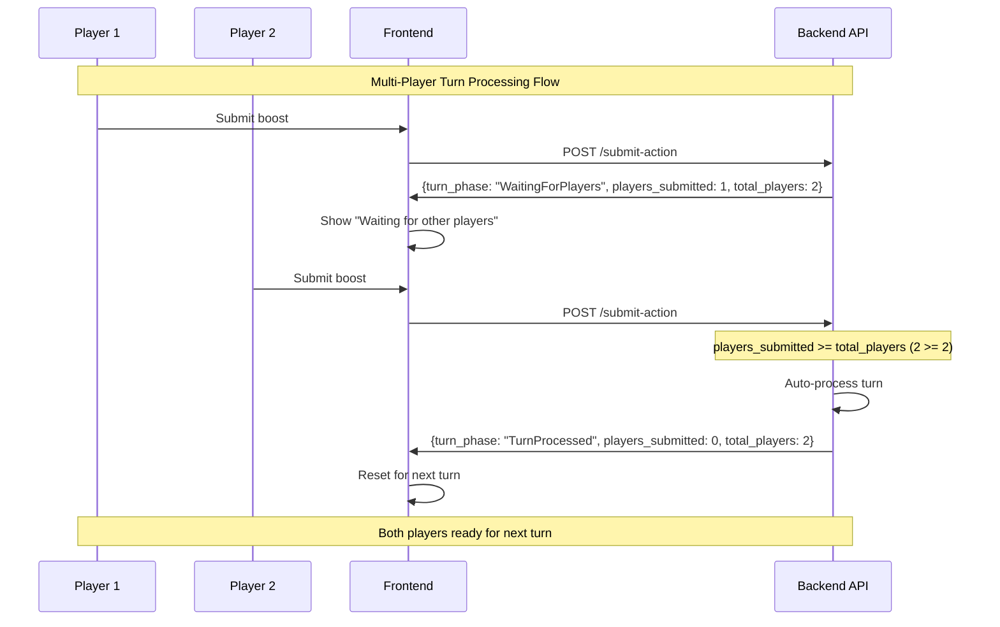

# Feature #15: Single Player Turn Processing Fix

## Problem Description

When a single player submits a boost in a race, the game gets stuck in "waiting for players" state even though the turn should be processed immediately since there's only one player.

### Root Cause Analysis

The backend logic was actually working correctly:
1. Single player submits boost action
2. Backend detects `players_submitted >= total_players` (1 >= 1)
3. Backend auto-processes the turn immediately
4. Backend returns `turn_phase: "WaitingForPlayers"` and `players_submitted: 0` for next turn

The issue was in the frontend logic in `PlayerGameContext.tsx`:
- The response handling wasn't properly distinguishing between "still waiting" vs "turn completed"
- The condition `response.turn_phase === 'WaitingForPlayers'` was ambiguous
- Race conditions in state updates and data refreshing
- UI remained in "Processing" state even after turn completion

## Solution Implemented

### New TurnProcessed State

Added a new `TurnProcessed` state to clearly signal when a turn has been completed and the UI should reset:

**Backend Changes:**
- Added `TurnProcessed` to `TurnPhase` enum
- `submit_turn_action` returns `turn_phase: "TurnProcessed"` when turn is auto-processed
- Updated all response type documentation

**Frontend Changes:**
- Added `TurnProcessed` to all TypeScript type definitions
- Enhanced response handling to detect `TurnProcessed` and immediately reset UI
- Removed ambiguous logic that relied on `players_submitted` count

## Turn Processing Flow - Sequence Diagram



## Multi-Player Comparison



## Key Improvements

### 1. **Clear State Signaling**
- `TurnProcessed` provides unambiguous signal that turn completed
- Eliminates confusion between "waiting" and "completed" states
- No more reliance on `players_submitted` count for state detection

### 2. **Immediate UI Reset**
```typescript
if (response.turn_phase === 'TurnProcessed') {
  // Turn was auto-processed and completed - reset for next turn immediately
  console.log('Turn auto-processed, resetting for next turn');
  dispatch({ type: 'SET_HAS_SUBMITTED', payload: false });
  dispatch({ type: 'SET_SELECTED_BOOST', payload: null });
  dispatch({ type: 'SET_TURN_PHASE', payload: 'WaitingForPlayers' });
  
  // Refresh race data to get updated positions
  setTimeout(async () => {
    await updateRaceData();
  }, 500);
}
```

### 3. **Eliminated Polling Dependency**
- Single-player races no longer need polling for turn completion
- Immediate response handling provides instant UI reset
- Polling still available for edge cases and multi-player scenarios

### 4. **Better Error Handling**
- Clear logging for each response scenario
- Timeout protection in polling logic
- Graceful fallback for network errors

## State Transition Table

| Current State | Action | Backend Response | New State | UI Behavior |
|---------------|--------|------------------|-----------|-------------|
| WaitingForPlayers | Submit Boost (Single Player) | TurnProcessed | WaitingForPlayers | Immediate reset, refresh data |
| WaitingForPlayers | Submit Boost (Multi-Player, not all) | WaitingForPlayers | WaitingForPlayers | Show waiting message |
| WaitingForPlayers | Submit Boost (Multi-Player, all) | TurnProcessed | WaitingForPlayers | Immediate reset, refresh data |
| Processing | Polling detects completion | WaitingForPlayers | WaitingForPlayers | Reset after polling |

## Testing Scenarios

### Single Player Race
1. ✅ Player selects boost (0-4)
2. ✅ Player clicks submit
3. ✅ Backend immediately processes turn (1/1 players)
4. ✅ Frontend detects `TurnProcessed` and resets immediately
5. ✅ Race data refreshes with updated positions
6. ✅ Player can submit next turn without delay

### Multi-Player Race
1. ✅ First player submits → Shows "waiting for players"
2. ✅ Second player submits → Backend auto-processes
3. ✅ Both frontends detect `TurnProcessed` and reset
4. ✅ All players ready for next turn

## Files Modified

- `rust-backend/src/routes/races.rs`
  - Added `TurnProcessed` to `TurnPhase` enum
  - Updated `submit_turn_action` to return `TurnProcessed` on auto-processing
  - Updated response documentation

- `empty-project/src/contexts/PlayerGameContext.tsx`
  - Enhanced `submitBoostAction` to handle `TurnProcessed` response
  - Improved error handling and logging

- `empty-project/src/types/race-api.ts`
- `empty-project/src/types/race.ts`  
- `empty-project/src/utils/raceAPI.ts`
  - Added `TurnProcessed` to TypeScript type definitions

## Branch Information

- **Branch**: `feature/15-single-player-turn-processing-fix`
- **Status**: Implementation complete with sequence diagram documentation
- **Next Step**: End-to-end testing and approval

## Testing Instructions

1. Start the full stack: `.\start-full-stack.ps1`
2. Create a single-player race
3. Submit boost actions and verify immediate processing
4. Check browser console for "Turn auto-processed, resetting for next turn" logs
5. Verify race data updates correctly after each turn
6. Test multi-player scenarios to ensure compatibility

The fix ensures smooth single-player race progression while maintaining full compatibility with multi-player scenarios.