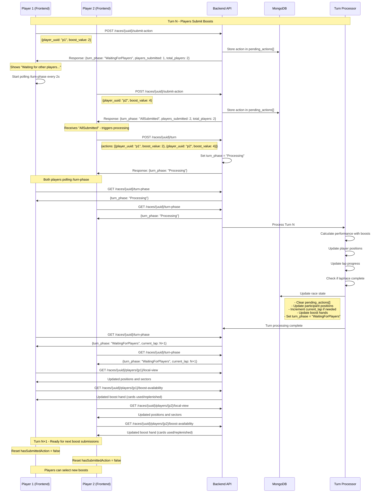

# Turn Processing Sequence Flow

## Complete Turn Processing Flow - From Boost Submission to Next Turn



## Key State Transitions

### 1. Individual Submission Phase
- **State**: `WaitingForPlayers`
- **Action**: Players submit boosts individually
- **Response**: Current submission count and phase status

### 2. All Submitted Trigger
- **State**: `AllSubmitted` 
- **Action**: Last player's submission triggers turn processing
- **Critical**: Frontend must immediately call `/turn` endpoint

### 3. Processing Phase
- **State**: `Processing`
- **Action**: Backend calculates turn results
- **Duration**: 1-3 seconds typically
- **Frontend**: Polls every 2 seconds for completion

### 4. Next Turn Ready
- **State**: `WaitingForPlayers` (new turn)
- **Action**: Clear submitted flags, update race data
- **Frontend**: Fetch updated positions and boost availability

## Implementation Requirements

### Backend Changes Needed:

1. **Automatic Processing Option** (Alternative approach):
```rust
// In submit_turn_action, after storing the action:
if players_submitted >= total_players {
    // Option A: Trigger processing immediately
    tokio::spawn(async move {
        process_lap_in_db(&database, race_uuid, all_actions).await
    });
    
    return Ok(SubmitTurnActionResponse {
        turn_phase: "Processing".to_string(),
        // ...
    });
}
```

2. **Turn Processing Endpoint Enhancement**:
```rust
// Ensure process_turn clears pending_actions and resets state
pub async fn process_turn() {
    // Process the turn
    let result = process_lap_in_db(database, race_uuid, actions).await?;
    
    // Reset for next turn
    // - Clear pending_actions
    // - Set turn_phase = "WaitingForPlayers" 
    // - Update boost hands
    // - Increment lap if needed
}
```

### Frontend Changes Needed:

1. **Fix API Call**:
```typescript
// In PlayerGameContext.tsx
const submitBoostAction = async () => {
  // Use submitTurnAction instead of processRaceTurn
  const response = await raceAPIService.submitTurnAction(
    state.race.uuid, 
    state.playerUuid, 
    state.selectedBoost
  );
  
  if (response.turn_phase === "AllSubmitted") {
    // Trigger turn processing
    await triggerTurnProcessing();
  }
};
```

2. **Add Turn Processing Trigger**:
```typescript
const triggerTurnProcessing = async () => {
  // Get all pending actions and process the turn
  const actions = await getAllPendingActions();
  await raceAPIService.processRaceTurn(state.race.uuid, actions);
  
  // Start polling for completion
  startTurnPolling();
};
```

3. **Enhanced Polling Logic**:
```typescript
const startTurnPolling = () => {
  // Poll until turn_phase changes from "Processing" to "WaitingForPlayers"
  // Then refresh all race data and reset submission state
};
```

## Recommended Approach

I recommend **Option A: Backend Auto-Processing** because:

1. **Simpler Frontend**: No complex orchestration needed
2. **Atomic Operation**: Turn processing happens immediately when ready
3. **Better UX**: Faster transition, no additional API calls
4. **Fault Tolerant**: No risk of frontend failing to trigger processing

Would you like me to implement this approach?